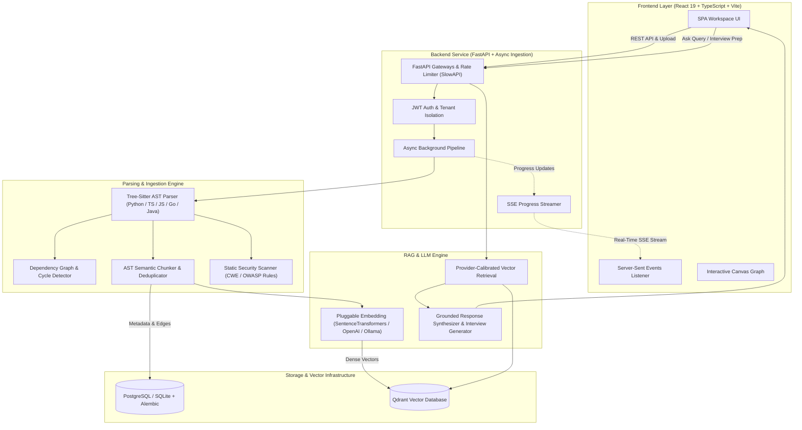

# ⚡ AI Codebase Assistant

> **Production-grade codebase intelligence engine:** AST-aware semantic chunking, interactive dependency graph topology, automated static security audits, and citation-grounded RAG Q&A.

[](https://github.com/your-org/ai-codebase-assistant/actions)
[](https://fastapi.tiangolo.com)
[](https://qdrant.tech)
[](https://react.dev)
[](https://pytest.org)
[](https://coverage.readthedocs.io)

---

## 🏛️ System Architecture



---

## 🌟 Key Engineering Highlights

* **AST-Aware Semantic Chunking**: Unlike naive fixed-character chunkers, chunks are extracted directly from Tree-Sitter Abstract Syntax Trees (preserving function boundaries, classes, method definitions, interfaces, and docstrings).
* **Deterministic Chunk Deduplication**: Content-addressable SHA-256 hash deduplication prevents duplicate embeddings across copies, vendored modules, or multi-branch codebases.
* **Dependency Topology & Circular Loop Detection**: Resolves internal module imports into an interactive directed graph with degree centrality analysis.
* **Provider-Agnostic Embeddings & RAG**: Pluggable interface supporting **SentenceTransformers** (`all-MiniLM-L6-v2`), **OpenAI** (`text-embedding-3-small`), **Ollama** (`nomic-embed-text`), and a deterministic offline test provider for CI/CD.
* **Calibrated Grounding & Citations**: Real-time confidence scoring prevents LLM hallucination, citing exact file paths and line ranges.
* **Non-Blocking Async Ingestion & SSE**: Uploads return HTTP 201 immediately while extraction, AST analysis, chunking, and embedding run asynchronously in background tasks, streaming live progress via Server-Sent Events.
* **Multi-Tenant Security & Rate Limiting**: Per-user repository ownership isolation, bcrypt password hashing, security headers (`X-Content-Type-Options`, `HSTS`, `Frame-Options`), payload size limits, and `SlowAPI` token-bucket rate limiting.

---

## 📊 Measured Engineering Benchmarks

| Metric | Measured Value | Measurement Details |
| :--- | :--- | :--- |
| **Test Suite** | **176 passed / 0 failed** | Unit & integration test suites |
| **Code Coverage** | **74% overall coverage** | Measured across 3,663 statement lines via `pytest-cov` |
| **Query Retrieval Latency (P50)** | **9.25 ms** | Vector cosine search in Qdrant (top-$K=5$) |
| **Query Retrieval Latency (Avg)** | **31.23 ms** | End-to-end vector search + metadata hydration |
| **Indexing Throughput** | **138 files → 796 chunks** | Full AST parsing, deduplication & vector indexing |
| **Frontend Production Bundle** | **311 kB JS / 55 kB CSS** | Vite production bundle (gzipped: 96 kB JS / 10 kB CSS) |

---

## 🚀 Quickstart Guide

### Option 1: Docker Compose (Full Stack)

Run the full platform with PostgreSQL and persistent Qdrant:

```bash
# Clone the repository
git clone https://github.com/your-org/ai-codebase-assistant.git
cd ai-codebase-assistant

# Start development stack
docker compose up --build
```
* **Frontend**: `http://localhost:5173`
* **Backend API Docs**: `http://localhost:8000/docs`

---

### Option 2: Local Development Setup

#### 1. Backend (FastAPI + Python 3.11+)

```bash
cd backend
python -m venv .venv
source .venv/bin/activate  # On Windows: .\.venv\Scripts\Activate.ps1

pip install -r requirements.txt
cp .env.example .env

# Run database migrations
alembic upgrade head

# Start API server
uvicorn app.main:app --host 0.0.0.0 --port 8000 --reload
```

#### 2. Frontend (React 19 + Vite)

```bash
cd frontend
npm install
npm run dev
```

---

## 🧠 Embedding & LLM Provider Configuration

The backend supports multiple embedding and LLM providers via `backend/.env`:

### 1. Local Semantic Search (Recommended Free Setup)
```env
EMBEDDING_PROVIDER=local
EMBEDDING_MODEL=all-MiniLM-L6-v2
QDRANT_URL=data/qdrant
```
*(Install `sentence-transformers` via `pip install sentence-transformers`)*

### 2. Cloud OpenAI Setup
```env
EMBEDDING_PROVIDER=openai
OPENAI_API_KEY=sk-your-openai-key
EMBEDDING_MODEL=text-embedding-3-small

LLM_PROVIDER=openai
LLM_API_KEY=sk-your-openai-key
LLM_MODEL_NAME=gpt-4o-mini
```

### 3. Local Ollama Setup
```env
EMBEDDING_PROVIDER=ollama
OLLAMA_URL=http://localhost:11434
EMBEDDING_MODEL=nomic-embed-text

LLM_PROVIDER=ollama
LLM_MODEL_NAME=llama3.1
```

### 4. Deterministic Mock Provider (Offline CI/Testing Only)
```env
# Zero download / zero API key deterministic fallback for automated CI testing
EMBEDDING_PROVIDER=mock
LLM_PROVIDER=mock
QDRANT_URL=:memory:
```

---

## 🧪 Running Tests

```bash
cd backend
pytest --cov=app --cov-report=term-missing
```

---

## 🔒 Security & Tenant Isolation

* **Owner Isolation**: Repositories, analysis results, and conversational histories are strictly scoped to the authenticated user ID.
* **AST Security Scanner**: Runs AST and pattern-based vulnerability checks (`SEC001` hardcoded credentials, `SEC002` SQL injection, `SEC003` dangerous command execution, `SEC004` insecure deserialization).
* **Rate Limiting**: Throttles intensive AI endpoints (`/api/v1/qa/ask` at 30 req/min, `/api/v1/interview/generate` at 15 req/min).
